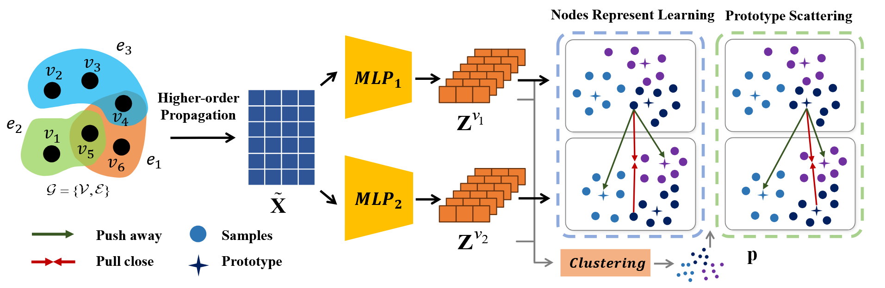
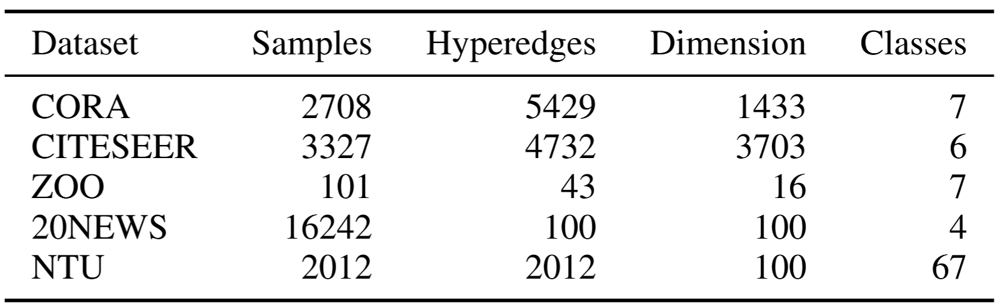
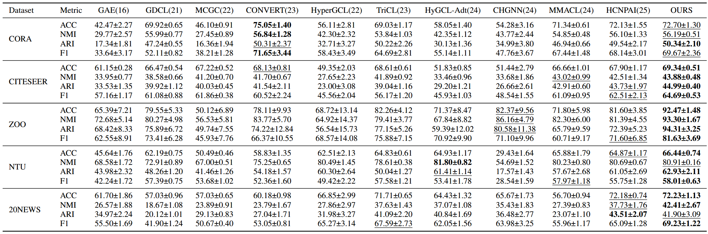
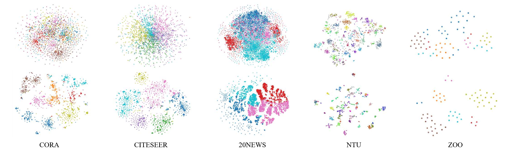

# Prototype-based Hypergraph Contrastive Clustering (PHCC)

## Overview

<p align = "justify"> 
Hypergraph clustering is a fundamental task in hypergraph analysis. Recently, contrastive learning-based hypergraph clustering methods have achieved remarkable results, but their performance is often limited by false negative sample interference in contrastive learning and plagued by the class collision problem. To address these challenges, this paper proposes Prototype-based Hypergraph Contrastive Clustering (PHCC). On one hand, using prototypes as negative samples enables synchronous optimization of node representations and clustering tasks, avoiding the adverse impact of false negatives and solving class collision. On the other hand, a prototype scattering loss function is designed to align and homogenize prototypes at the cluster level, effectively enhancing inter-cluster separability. Experimental results on multiple benchmark datasets verify the method’s effectiveness.

<div  align="center">    
    
</div>

<div  align="center">    
    Figure 1: Framework.
</div>

## Requirements

The proposed PHCC is implemented with python 3.7 on a NVIDIA GeForce RTX 4090 GPU. 

The following packages are required:

- torch==2.0.1
- tqdm==4.61.2
- numpy==1.21.0
- munkres==1.1.4
- scikit_learn==1.0
- scipy==1.5.4
- torch-geometric==2.0.3
- torch-scatter==2.0.9
- torch-sparse==0.6.12

## Dataset

Only two example datasets, ZOO (hypergraph) and CORA (graph), are provided in the code. For other datasets, please download them using the following method and place the datasets in the `./data` folder.

Graph data sets are downloaded from
https://github.com/yueliu1999/Awesome-Deep-Graph-Clustering/blob/main/dataset

Hypergraph data sets are downloaded from
https://github.com/weitianxin/HyperGCL/tree/master/data

<div  align="center">    
    
</div>
<div  align="center">    
    Table 1: Dataset.
</div>

## Quick Start

```python
# Quick Start
python train.py
```

```python
# Graph Dataset
python train.py --dataset cora --cluster_num 7
python train.py --dataset citeseer --cluster_num 6
python train.py --dataset amap --cluster_num 8
python train.py --dataset pubmed --cluster_num 3

# Hapergraph Dataset# 
python train.py --dataset NTU2012
python train.py --dataset zoo --cluster_num 7
python train.py --dataset ModelNet40 --cluster_num 40
python train.py --dataset 20news --cluster_num 4
```


## Clustering Results

### Comparative Experiment

<div  align="center">    
    
</div>
<div  align="center">    
    Table 2: Clustering results.
</div>

### Visualization

<div  align="center">    
    
</div>
<div  align="center">    
    Figure 2: 2D <i>t</i>-SNE visualization.
</div>

### Raw Experimental Records

```bash

# CORA

===== Loading dataset: cora 
feat shape: (2708, 1433)
label shape: (2708,)
adj shape: (2708, 2708)
===== Train
100%|██████████████████████████████████████████████████████████████████████████████████████████████████████████████| 300/300 
epoch:  299 acc:  72.30428360413589 nmi:  56.55854444211295 ari:  49.71240743597187 f1:  68.26855938696647
100%|██████████████████████████████████████████████████████████████████████████████████████████████████████████████| 300/300 
epoch:  299 acc:  75.11078286558346 nmi:  56.73574256126622 ari:  53.165616522355464 f1:  73.95924572145869
100%|██████████████████████████████████████████████████████████████████████████████████████████████████████████████| 300/300 
epoch:  299 acc:  71.30723781388478 nmi:  56.470197991985614 ari:  47.49930062403678 f1:  67.67940021009957
100%|██████████████████████████████████████████████████████████████████████████████████████████████████████████████| 300/300 
epoch:  299 acc:  72.82127031019202 nmi:  55.81514111659196 ari:  52.33025660945992 f1:  70.53166122531132
100%|██████████████████████████████████████████████████████████████████████████████████████████████████████████████| 300/300 
epoch:  299 acc:  71.97193500738553 nmi:  55.373808143176774 ari:  48.998567098342384 f1:  67.94978705086777
===== Final Results
ACC: 72.7031 ± 1.3002
NMI: 56.1907 ± 0.5136
ARI: 50.3412 ± 2.1075
F1: 69.6777 ± 2.3675

# CITESEER

===== Loading dataset: citeseer 
feat shape: (3327, 3703)
label shape: (3327,)
adj shape: (3327, 3327)
===== Train
100%|██████████████████████████████████████████████████████████████████████████████████████████████████████████████| 300/300 
epoch:  299 acc:  69.40186354072738 nmi:  43.84965353714688 ari:  44.99763591059663 f1:  64.4200305823454
100%|██████████████████████████████████████████████████████████████████████████████████████████████████████████████| 300/300 
epoch:  299 acc:  69.25157799819658 nmi:  43.95935288406085 ari:  44.770111396902806 f1:  65.0947365450164
100%|██████████████████████████████████████████████████████████████████████████████████████████████████████████████| 300/300 
epoch:  299 acc:  69.91283438533213 nmi:  44.27597652914905 ari:  45.569764679406795 f1:  65.12918853151696
100%|██████████████████████████████████████████████████████████████████████████████████████████████████████████████| 300/300 
epoch:  299 acc:  69.73249173429517 nmi:  44.339858232342806 ari:  45.253854718093905 f1:  65.07645384916245
100%|██████████████████████████████████████████████████████████████████████████████████████████████████████████████| 300/300 
epoch:  299 acc:  68.4400360685302 nmi:  42.98776753828903 ari:  44.380437691691796 f1:  63.77086797908045
===== Final Results
ACC: 69.3478 ± 0.5106
NMI: 43.8825 ± 0.4841
ARI: 44.9944 ± 0.4064
F1: 64.6983 ± 0.5336

# ZOO

===== Loading dataset: zoo 
Loading zoo dataset ...
feat shape: (101, 16)
label shape: (101,)
adj shape: (101, 101)
===== Train
100%|██████████████████████████████████████████████████████████████████████████████████████████████████████████████| 300/300 
epoch:  299 acc:  91.0891089108911 nmi:  94.51023223813165 ari:  96.84365932442357 f1:  76.11925111925112
100%|██████████████████████████████████████████████████████████████████████████████████████████████████████████████| 300/300 
epoch:  299 acc:  91.0891089108911 nmi:  93.77858459359656 ari:  88.37166730257911 f1:  80.70500927643785
100%|██████████████████████████████████████████████████████████████████████████████████████████████████████████████| 300/300 
epoch:  299 acc:  93.06930693069307 nmi:  94.85231554931143 ari:  97.05120925209675 f1:  82.26363008971705
100%|██████████████████████████████████████████████████████████████████████████████████████████████████████████████| 300/300
epoch:  299 acc:  95.04950495049505 nmi:  93.25868798332755 ari:  95.96244333018419 f1:  87.67494557631666
100%|██████████████████████████████████████████████████████████████████████████████████████████████████████████████| 300/300 
epoch:  299 acc:  92.07920792079209 nmi:  90.14702328998564 ari:  93.32547516338818 f1:  81.42948142948143
===== Final Results
ACC: 92.4752 ± 1.4818
NMI: 93.3094 ± 1.6761
ARI: 94.3109 ± 3.2526
F1: 81.6385 ± 3.6934

# NTU2012

===== Loading dataset: NTU2012 
Loading NTU2012 dataset ...
feat shape: (2012, 100)
label shape: (2012,)
adj shape: (2012, 2012)
===== Train
Run 0: 100%|█████████████████████████████████████████████████████████████████████████████████████████████████████████████| 300/300 [03:27<00:00,  1.45it/s]
Run 0 - Epoch: 299, Acc: 66.0537, NMI: 80.8272, ARI: 62.5678, F1: 57.7618
Run 1: 100%|█████████████████████████████████████████████████████████████████████████████████████████████████████████████| 300/300 [03:29<00:00,  1.43it/s]
Run 1 - Epoch: 299, Acc: 65.4573, NMI: 80.9746, ARI: 60.9916, F1: 56.6177
Run 2: 100%|█████████████████████████████████████████████████████████████████████████████████████████████████████████████| 300/300 [03:33<00:00,  1.40it/s]
Run 2 - Epoch: 299, Acc: 67.8926, NMI: 81.2067, ARI: 63.6000, F1: 60.5805
Run 3: 100%|█████████████████████████████████████████████████████████████████████████████████████████████████████████████| 300/300 [03:21<00:00,  1.49it/s]
Run 3 - Epoch: 299, Acc: 67.5447, NMI: 81.4068, ARI: 60.7279, F1: 59.1107
Run 4: 100%|█████████████████████████████████████████████████████████████████████████████████████████████████████████████| 300/300 [03:33<00:00,  1.41it/s]
Run 4 - Epoch: 299, Acc: 67.3459, NMI: 81.5025, ARI: 64.4025, F1: 58.1131
===== Final Results
ACC: 66.8588 ± 0.9369
NMI: 81.1835 ± 0.2541
ARI: 62.4580 ± 1.4311
F1: 58.4368 ± 1.3356

# 20NEWS

===== Loading dataset: 20news
Loading 20news dataset ...
feat shape: (16264, 100)
label shape: (16264,)
adj shape: (16264, 16264)
===== Train
100%|██████████████████████████████████████████████████████████████████████████████████████████████████████████████| 300/300 
epoch:  299 acc:  72.29955730447614 nmi:  41.9147558675589 ari:  39.504907762419784 f1:  71.04656984563523
100%|██████████████████████████████████████████████████████████████████████████████████████████████████████████████| 300/300 
epoch:  299 acc:  73.22183964584358 nmi:  44.325435063346994 ari:  44.47312150319489 f1:  69.52973311290945
100%|██████████████████████████████████████████████████████████████████████████████████████████████████████████████| 300/300 
epoch:  299 acc:  72.84677816035415 nmi:  44.26653274638132 ari:  44.23340391596088 f1:  69.03222972731061
100%|██████████████████████████████████████████████████████████████████████████████████████████████████████████████| 300/300 
epoch:  299 acc:  72.76684702410231 nmi:  44.17380276472646 ari:  44.32019087680416 f1:  69.3581620278028
100%|██████████████████████████████████████████████████████████████████████████████████████████████████████████████| 300/300 
epoch:  299 acc:  70.04303984259715 nmi:  37.37075348619867 ari:  36.98285193128912 f1:  67.22933238972227
===== Final Results
ACC: 72.2356 ± 1.1349
NMI: 42.4103 ± 2.6783
ARI: 41.9029 ± 3.0931
F1: 69.2392 ± 1.2205
```